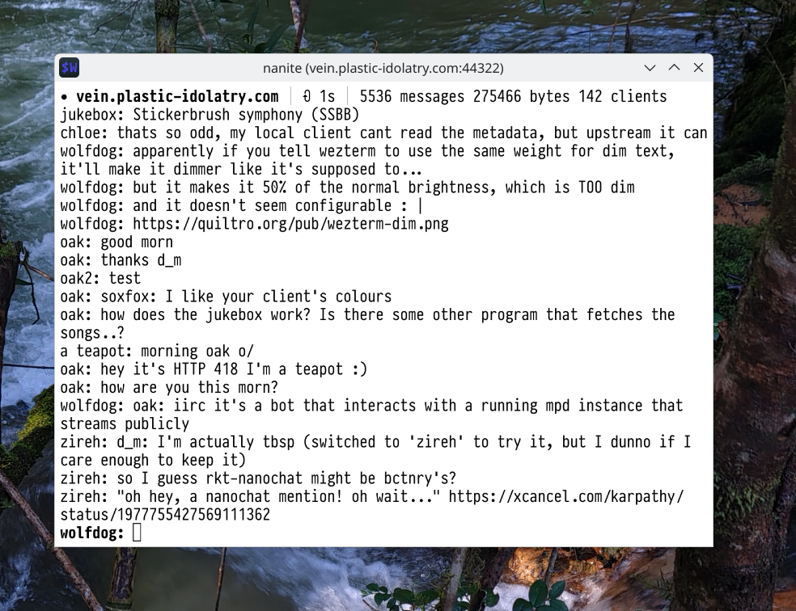

# nanite

`nanite` is a terminal [Nanochat] client.

> Note: I've moved this to my personal Forgejo instance.  The upstream URL
> is now https://git.rhzm.org/lobo/nanite :)



## build

```
$ go build .
```

## usage

```
$ ./nanite
usage: ./nanite host [port]
$ ./nanite very.real-server.com
```

keybindings:

- `Ctrl+C`: quit
- `Ctrl+L`: refresh screen
- `Ctrl+P`: poll

commands:

- `/dial hostname`: connect to server
- `/hangup`: disconnect
- `/q`, `/quit`: quit
- `/nick [nickname]`: change nick, if no arguments, show current nick
- `/me`: IRC `/me` alike
- `/poll [seconds]`: change polling interval, if no arguments, poll manually

## won't support (yet)

- sixel (tried, it seems to be complicated to get it to work with Vaxis' pager
  widget)

[Nanochat]: https://git.phial.org/d6/nanochat
[Vaxis]: https://git.sr.ht/~rockorager/vaxis
